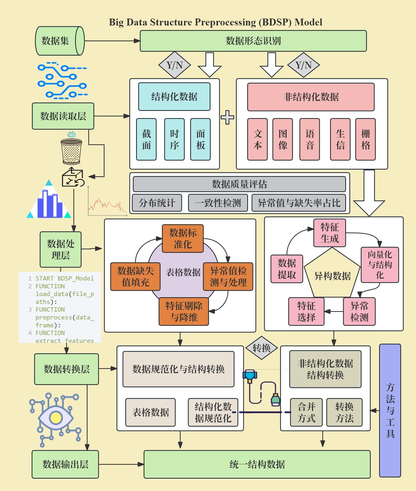

# BDSP-Model

## 项目简介

**BDSP-Model** 是一个数据处理与分析的模型，旨在帮助用户高效地进行数据预处理、特征工程和模型训练。该项目提供了一套完整的工具和技术，以便于用户在数据科学和机器学习任务中快速开发和验证模型。

## 数据预处理模型框架

该框架包含以下模块：
- **数据读取**：支持从多种数据结构源读取数据（CSV、Excel、数据库等）；
- **数据清洗**：功能包括缺失值处理、异常值检测与处理，重复数据删除、数据标准化处理等；
- **特征选择**：根据统计方法或模型自动适应数据分布形态选择最佳清洗方法，高效提取重要特征，提升模型效果；
- **数据变换**：将数据转化为表格数据，除常规结构化数据（截面、时序、面板），同样包括非结构化数据如文本、图像、声音等等；
- **数据合并**：提供简单高效便捷的数据信息合并方式，为大数据分析和数据整理提供便捷性服务。
- **数据输出与可视化**：提供高质量的数据清洗结果，较小的损失数据信息熵，增强数据的可靠性，减去脏数据信息。
