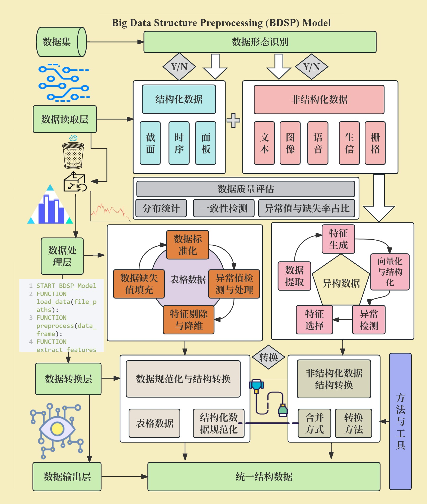

# BDSP-Model

## 项目简介

**BDSP-Model** 是一个高效的数据处理与分析模型，旨在帮助用户简化数据预处理、特征工程和模型训练的工作。项目提供了一套完整的工具和技术，使用户能快速开发和验证数据科学与机器学习任务中的模型。

## 数据预处理模型框架

该框架包含以下模块：
- **数据读取**：支持从多种数据结构源读取数据（Text、Png、CSV、Excel、Audio、Raster等）；
- **数据清洗**：提供缺失值处理、异常值检测与处理、重复数据删除、数据标准化等功能，以确保数据准确性；
- **特征选择**：根据统计方法或模型自动适应数据分布形态选择最佳清洗方法，高效提取重要特征，提升模型效果；
- **数据变换**：将数据转换为结构化格式，支持处理常规数据（如截面、时序、面板）及非结构化数据（如文本、图像、音频等）；
- **数据合并**：提供简单、快捷的数据合并方式，以支持大规模数据分析和整理；
- **数据输出与可视化**：提供高质量的数据清洗结果，较小的损失数据信息熵，增强数据的可靠性与规范性。

## 技术路线

## 技术栈

- numpy version: 1.26.4
- shap version: 0.45.0
- matplotlib version: 3.7.2
- xgboost version: 2.0.3
- pandas version: 2.3.0+4.g1dfc98e16a
- scikit-learn version: 1.3.0
- seaborn version: 0.12.2

###########################################################################
###方式2，更正
cd "C:\Users\沐阳\PycharmProjects\pythonProject3\BDSP-Model"

git pull origin main --allow-unrelated-histories

xcopy "C:\Users\沐阳\PycharmProjects\pythonProject3\BDSP-Model\data_processing_modified" "C:\Users\沐阳\PycharmProjects\pythonProject3\BDSP-Model\data_processing_v1" /E /I

git add data_processing_v1

git commit -m "添加: 新版本的 data_processing_modified 文件夹，以替代原有text模块的字典创建问题"

git push origin main

#######查看库版本######
import pandas as pd
import numpy as np
import matplotlib
import seaborn as sns
import scipy
import sklearn
import statsmodels
import snownlp
import jieba
import wordcloud

# 打印版本信息
print("Pandas version:", pd.__version__)
print("NumPy version:", np.__version__)
print("Matplotlib version:", matplotlib.__version__)
print("Seaborn version:", sns.__version__)
print("SciPy version:", scipy.__version__)
print("Scikit-learn version:", sklearn.__version__)
print("Statsmodels version:", statsmodels.__version__)
print("SnowNLP version:", snownlp.__version__)
print("Jieba version:", jieba.__version__)  # Jieba does not have __version__, it can be omitted or checked with the line below
print("WordCloud version:", wordcloud.__version__)

# 如果需要检查 Jieba 的版本，可以使用如下方法（虽然 Jieba 官方没有提供 __version__ 属性，但可以通过其路径文件获取）
try:
    jieba_version = jieba.__file__
    print(f"Jieba is installed at: {jieba_version}")
except AttributeError:
    print("Jieba version cannot be directly retrieved.")
